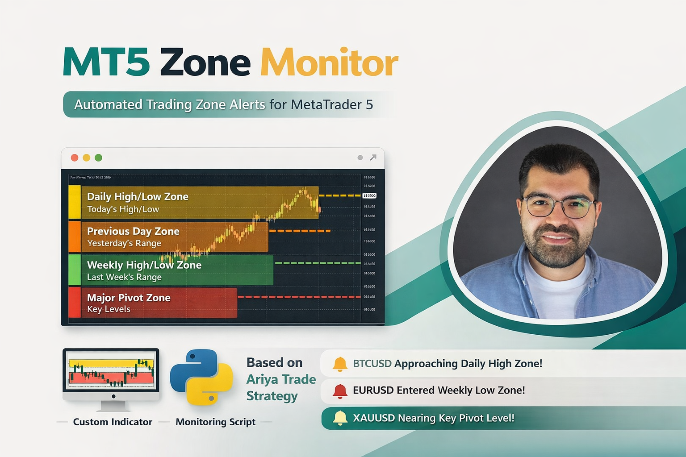

<p align="center">
  
</p>
#  MT5 Zone Monitor
## ابزار مانیتورینگ زون‌های مهم بازار بر اساس استراتژی سطوح روزانه و هفتگی

---

# 🎥 منبع استراتژی (ویدیو آموزشی)

این پروژه بر اساس استراتژی معرفی‌شده در ویدیوی زیر طراحی شده است:

📺 لینک ویدیو:
https://www.youtube.com/watch?v=yRaVX650-Zs

در این ویدیو، انواع سطوح مهم شامل:

- 🟨 Today High / Low  
- 🟧 Yesterday High / Low  
- 🟩 Last Week High / Low  
- 🟦 Current Week High / Low  
- 🟥 Higher Timeframe Levels  

به صورت کامل آموزش داده شده است.

پیشنهاد می‌شود قبل از استفاده از ابزار، حتماً این ویدیو را مشاهده کنید.

---

# 🧠 معرفی پروژه

**MT5 Zone Monitor** یک ابزار مانیتورینگ زنده است که:

✔ به MetaTrader 5 متصل می‌شود  
✔ نمادهای Market Watch را می‌خواند  
✔ زون‌های مهم قیمت را محاسبه می‌کند  
✔ قیمت را به صورت زنده بررسی می‌کند  
✔ هنگام رسیدن قیمت به زون‌ها هشدار می‌دهد  

هدف این ابزار این است که شما **نیازی به نگاه دائمی به چارت نداشته باشید**.

---

# 🎯 کاربرد پروژه

این ابزار مناسب:

✔ تریدرهای سبک Level-Based  
✔ تریدرهای Intraday  
✔ کاربران Multi-Symbol  
✔ افرادی که نمی‌خواهند دائم چارت نگاه کنند  

---

# 🎨 معنی رنگ زون‌ها

🟨 زرد — Today  
سقف و کف امروز

🟧 نارنجی — Yesterday  
سقف و کف دیروز

🟩 سبز — Last Week  
سقف و کف هفته قبل (مهم‌ترین)

🟦 آبی — Current Week  
سقف و کف هفته جاری

🟥 قرمز — Higher Timeframe  
سطوح تایم بالا

---

# 📊 نحوه استفاده از اندیکاتور

اندیکاتور داخل پوشه:

```
Indicator/
```

قرار دارد.

---

## مراحل استفاده از اندیکاتور

1️⃣ وارد TradingView شوید  

2️⃣ کد اندیکاتور را باز کنید  

3️⃣ یک Pine Script جدید بسازید  

4️⃣ کد اندیکاتور را Paste کنید  

5️⃣ روی Chart اجرا کنید  

---

## تنظیمات مهم اندیکاتور

✔ نمایش High / Low روزانه  
✔ نمایش High / Low هفتگی  
✔ تنظیم ضخامت زون  
✔ تنظیم رنگ زون‌ها  

---

# 🧰 پیش‌نیازها

قبل از اجرای پروژه:

✔ MetaTrader 5 نصب باشد  
✔ Python 3.10+ نصب باشد  
✔ حساب MT5 فعال باشد  

---

# 📥 نصب پروژه

دانلود:

```
git clone https://github.com/jalilahmad/mt5_zone_monitor.git
```

یا Download ZIP.

---

# 📦 نصب کتابخانه‌ها

```
pip install -r requirements.txt
```

---

# ▶️ اجرای برنامه

```
streamlit run app.py
```

بعد:

```
http://localhost:8501
```

باز می‌شود.

---

# 🔔 سیستم هشدار

هشدار زمانی فعال می‌شود که:

```
Distance ≤ ALERT_DISTANCE_PIPS
```

---

# ⚙️ تنظیمات

در فایل:

```
config.py
```

---

# 📁 ساختار پروژه

```
mt5_zone_monitor/

Indicator/
assets/

app.py
config.py
mt5_connector.py
watchlist.py
zone_calculator.py
price_monitor.py
alert_manager.py
time_utils.py

requirements.txt
README.md
```

---

#  MT5 Zone Monitor
## Real-Time Zone Monitoring Tool

---

# 🎥 Strategy Source Video

This project is based on the trading strategy explained in:

📺 Video Link:
https://www.youtube.com/watch?v=yRaVX650-Zs

This video explains:

- Today High / Low  
- Yesterday High / Low  
- Last Week High / Low  
- Current Week High / Low  
- Higher Timeframe Levels  

It is recommended to watch the video before using the tool.

---

# 🧠 Project Overview

MT5 Zone Monitor:

✔ Connects to MetaTrader 5  
✔ Reads Market Watch symbols  
✔ Calculates important price zones  
✔ Monitors price in real-time  
✔ Sends alerts when price approaches zones  

---

# 📊 Indicator Usage

Indicator is located in:

```
Indicator/
```

---

## How to Use Indicator

1️⃣ Open TradingView  

2️⃣ Create new Pine Script  

3️⃣ Paste indicator code  

4️⃣ Add to chart  

---

# 🧰 Requirements

✔ MetaTrader 5  
✔ Python 3.10+  
✔ Active trading account  

---

# 📥 Installation

```
git clone https://github.com/jalilahmad/mt5_zone_monitor.git
```

---

# 📦 Install Dependencies

```
pip install -r requirements.txt
```

---

# ▶️ Run Application

```
streamlit run app.py
```

---

# 🔔 Alert System

Alert triggers when:

```
Distance ≤ ALERT_DISTANCE_PIPS
```

---

# 👨‍💻 Author

Developed by:

Jalil Ahmad Fazeli

